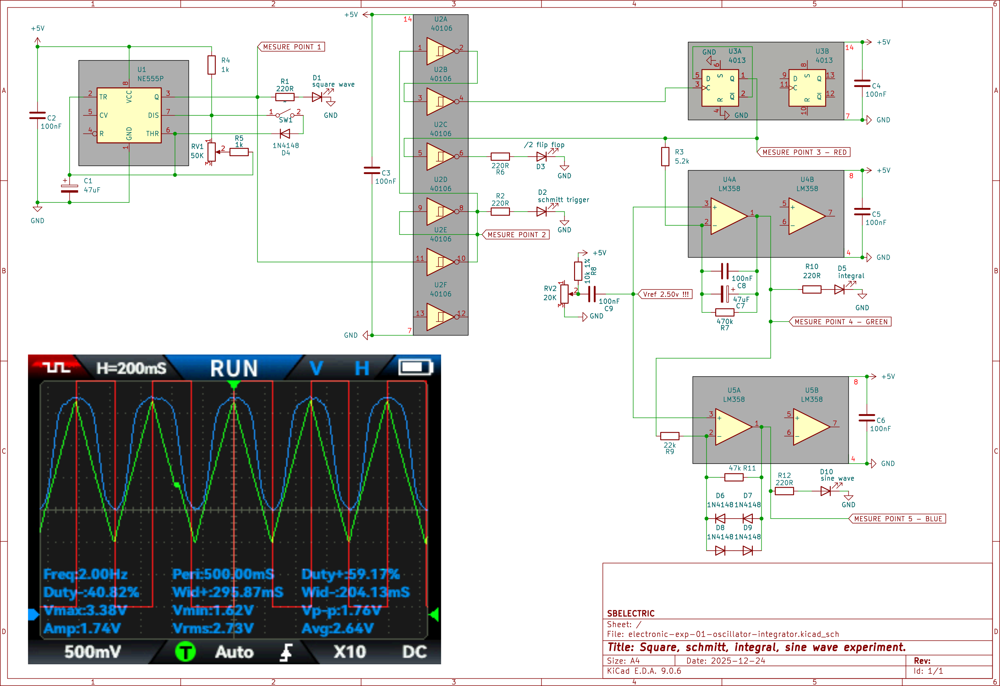
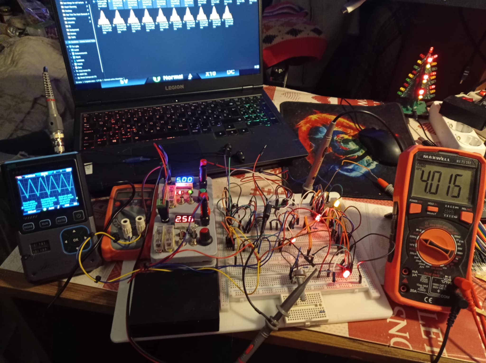
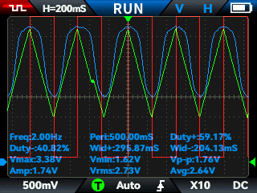

# Analog–Digital Signal Generator Experiment
### *Elektronikai tanuló kísérletek 01 négyszögjel, háromszögjel, szinuszjel előállítása, mérése.*

---

## 🖼 Kapcsolási rajz

---

## 🧰 Breadboard kísérleti panel

---

## 📌 Projekt célja
Ez a repository egy **gyakorlati elektronikai kísérletsorozatot** dokumentál, amelynek célja az volt, hogy megértsem, hogyan lehet egy **digitális órajelet analóg jelalakká formálni** műveleti erősítő és nemlineáris visszacsatolás segítségével.

A tanult jelút:

NE555 (4 Hz négyszögjel)
↓
CD40106 (Schmitt-trigger inverterek, él- és zaj-stabilizálás)
↓
CD4013 (flip-flop, 2 Hz, 50% duty cycle)
↓
LM358 integrátor (háromszög/fűrész jel előállítása)
↓
LM358 + 1N4148 diódaháló (nemlineáris feedback, szinusz-szerű alakformálás)

---

## 🧪 Mérések eredménye

---

## 📊 Jelparaméterek (a README készítésekor mért végleges értékek)

- **Digitális órajel (Flip-Flop kimenet)**  
  - Frekvencia: **2.2 Hz**
  - Duty cycle: **50%**
  - Amplitúdó: **5 Vpp**
  - Élminőség: **Schmitt-triggerrel stabilizált**

- **Integrátor (háromszögjel)**  
  - Frekvencia: **2.2 Hz**
  - Vpp: **2.16 V**
  - Vmax: **3.32 V**
  - Vmin: **1.17 V**
  - Szimmetria: **Vref-érzékeny, stabil bias esetén szép lineáris rámpa**

- **Diódás szinuszoid alakformáló kimenet**
  - Frekvencia: **2.2 Hz**
  - Vpp: **1.74 V**
  - Vmax: **3.38 V**
  - Vmin: **1.62 V**
  - Avg offset: **2.7 V**
  - Jelalak: **felül szépen kerekített, alul enyhén hegyes, de szinusz-szerű**

---

## 🔍 Főbb tanulási megfigyelések

✔ A műveleti erősítő feedback nélkül **telített invertáló komparátorként viselkedik**  
✔ Negatív feedback **(R + C)** esetén **integrál → háromszögjel**  
✔ Nemlineáris feedback **(diódák + poti)** esetén **csúcs-kompresszió → szinuszosabb jel**  
✔ Az integrátor **DC hibát felhalmoz**, ezért fontos a **stabil referencia (Vref) és leakage ellenállás**  
✔ Single-supply rendszernél a jel **nem lesz teljesen szimmetrikus a rail-ekhez**, munkapontot kell beállítani  
✔ Kristályoszcillátorhoz **unbuffered inverter (CD4069UBE)** ideális tanulásra és Pierce-osc építésre  

---

## 🛠 Használt alkatrészek

- **Órajel-forrás:** NE555
- **Jelstabilizálás:** CD40106 (Schmitt-trigger inverterek)
- **Duty felezés:** CD4013 flip-flop
- **Integrátor és szinuszformáló:** LM358
- **Nemlinearitás:** 4× 1N4148 diódaháló (2–2 sorban antiparallelben)
- **Táp-szűrés:** 100 nF kerámia (Vcc–GND)
- **Feedback leakage elleni stabilizálás:** 1 MΩ – 10 MΩ tartományban tesztelve

---

## 🧩 Diódaháló szerepe az alakformálásban

A diódák **csak a jel csúcsainál nyitnak ki**, így ott az op-amp erősítése lecsökken, és a háromszög **lekerekített görbévé formálódik**.

---

## ⏱ Következő lépés (tervezett)
A későbbi cél egy **kvarcalapú 1 Hz órajel előállítása**, amely:

- 32.768 kHz órakvarcról indul
- CD4060 belső oszcillátorán keresztül 2 Hz-et ad (Q14)
- CD4013-mal felezve **1 Hz stabil négyszögjelet** szolgáltat majd egy tisztán CMOS logikájú digitális óra számára.

---

## ✍️ Szerző
**Sándor Balázs**  